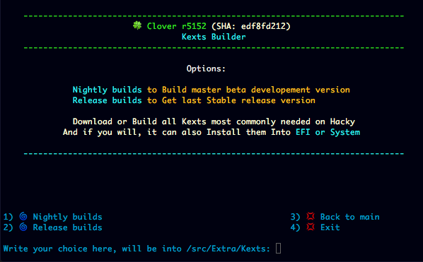
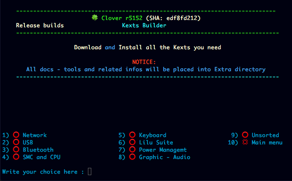
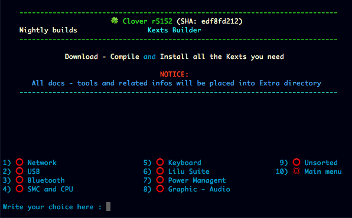
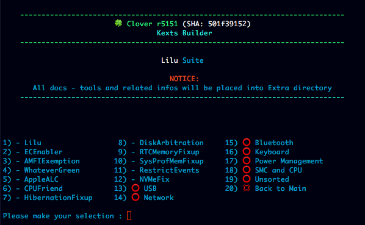
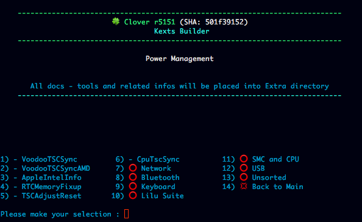
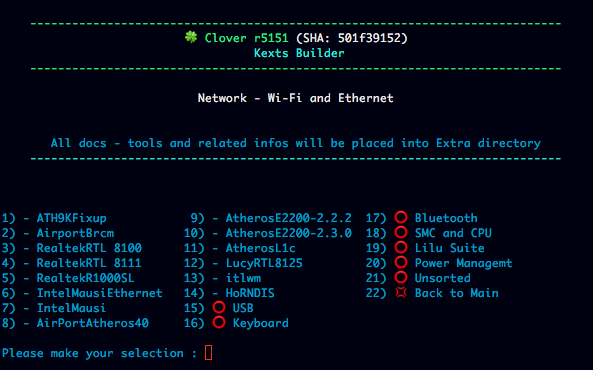
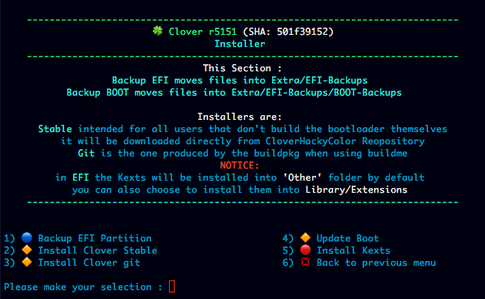
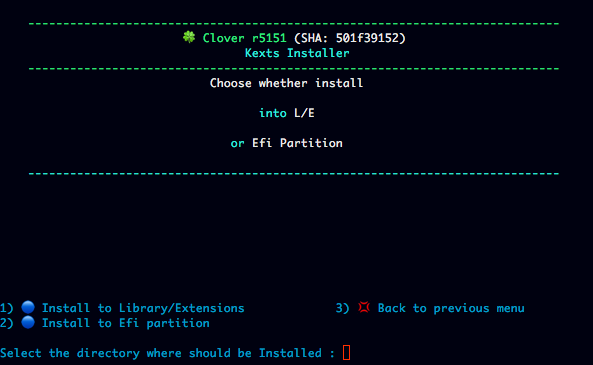

# Kexts builder

- Here you can find the most common, exyrnsions to adjust your machine needs 

- All kexts will be saved on Kexts directory into Extra Directory
#
- A few examples of kexts

# Kexts Installer

- From Kexts directory and from there you can choose to install/update into EFI or Library/Extensions
- - however since latest modifications in Apple's system files, 
- - Library/Extensions option will only be viable pre-Monterey builds

#
[Back](https://github.com/LAbyOne/Clover-Suite-Builder)
