# Internal and external tools

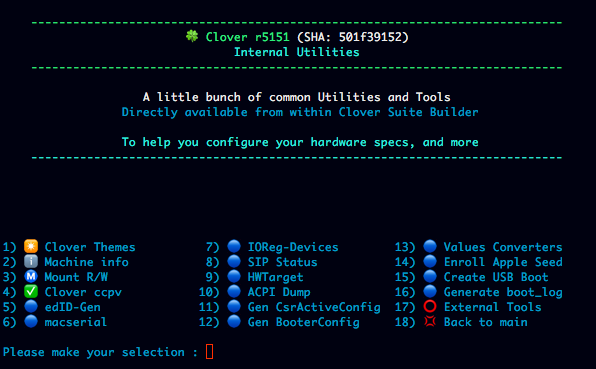
    
## Internal Utilities
### Machine Info

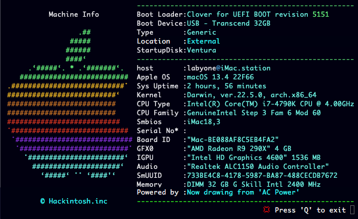

### ConfigPlist Validator

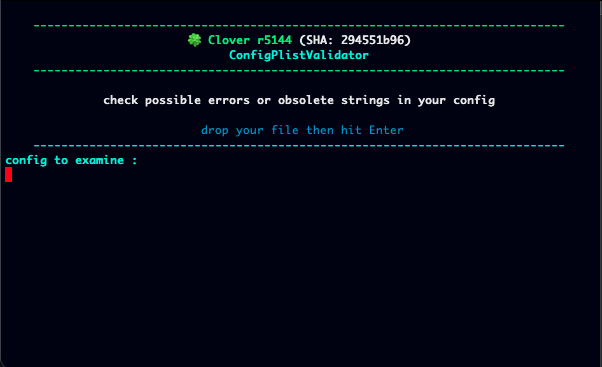

### Mac Serials Generator

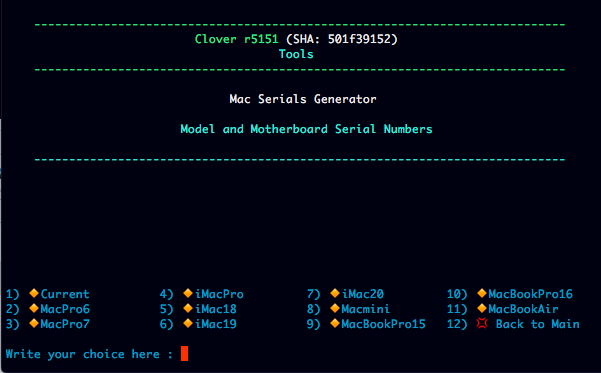

### CSRActive Config Generator

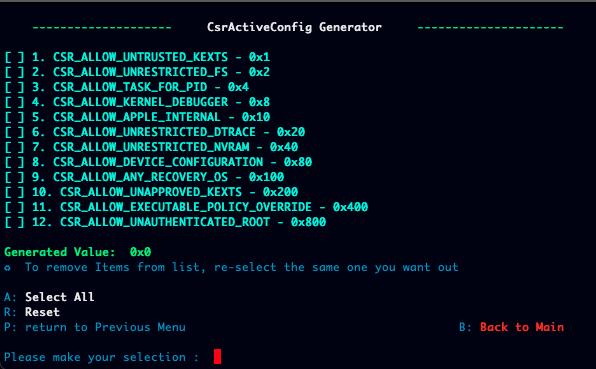

### Booter Config Generator

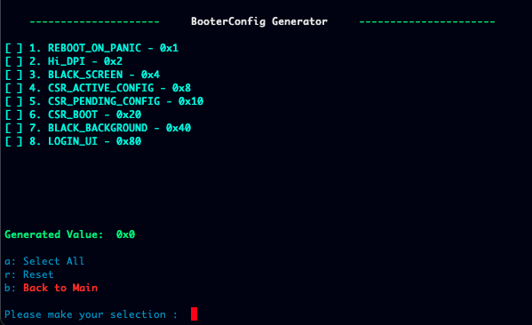

### Enroll Apple Seed

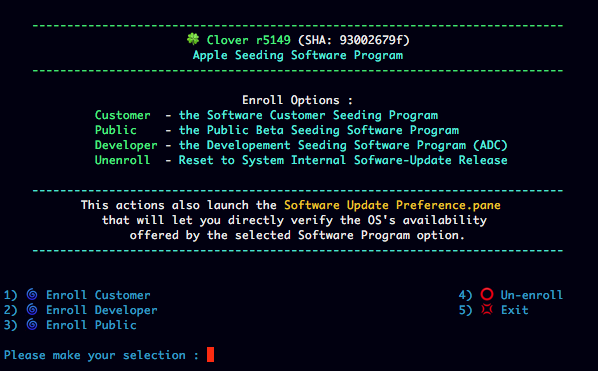

### OS Downloader and USB Boot Creator

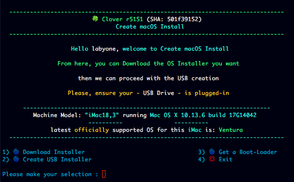

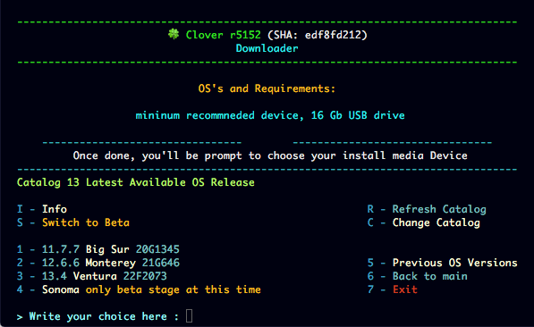

### Values Converters

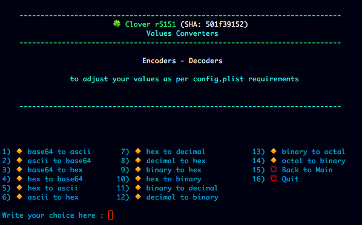

### SIP Status Verifier

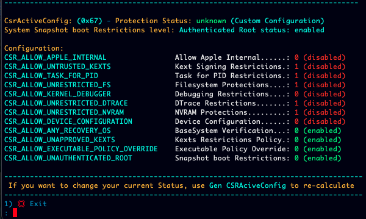

### HWTarget

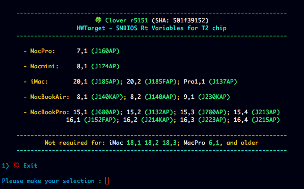

### Themes Downloader

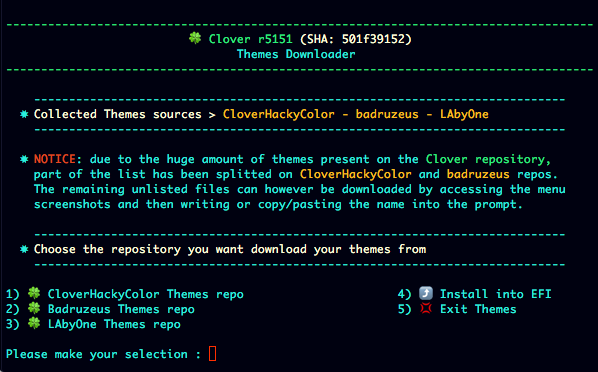

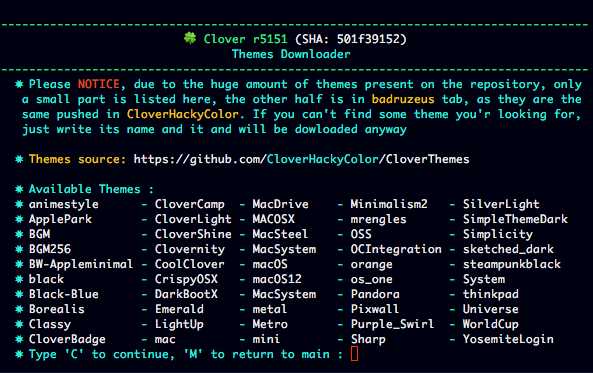

 - For any repo you got to get also screenshots of listed themes available
to  download

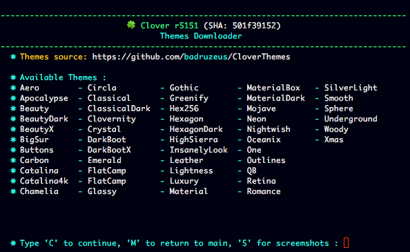

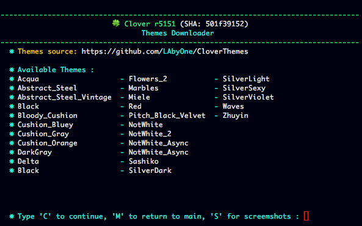

- eventually just by pressing 'A' key  will download the entire repo. 

#

- The downloaded theme is installed directly into EFI partion and,
 

- set (if you choose so) as Default

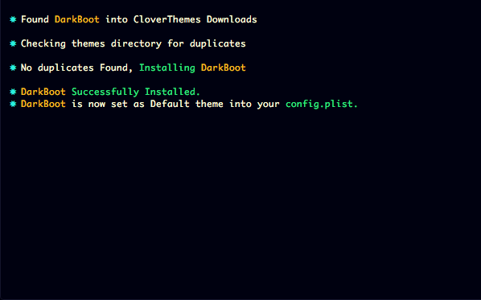

#

 - If for any reason you happen to download a theme already installed
 
 - install will be automatically skipped
 
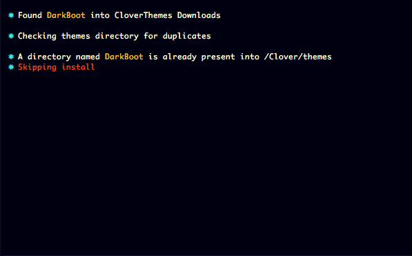
 
#
[Back](https://github.com/LAbyOne/Clover-Suite-Builder)
