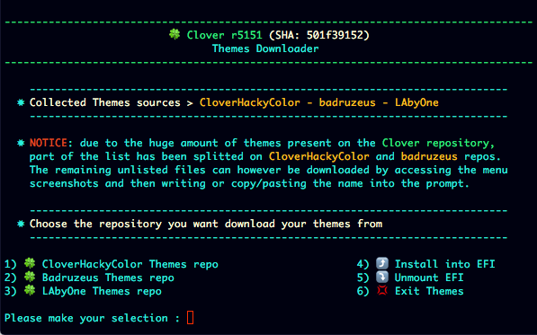
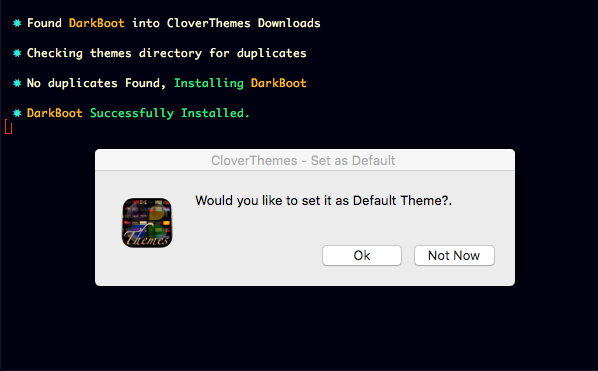

# Internal and external tools

    
## Internal Utilities
### Machine Info

### ConfigPlist Validator

### Mac Serials Generator

### CSRActive Config Generator

### Booter Config Generator

### Enroll Apple Seed

### OS Downloader and USB Boot Creator

### Values Converters

### SIP Status Verifier

### HWTarget

### Themes Downloader

 - For any repo you got to get also screenshots of listed themes available
to  download

- eventually just by pressing 'A' key  will download the entire repo. 

#

- The downloaded theme is installed directly into EFI partion and,
 

- set (if you choose so) as Default

#

 - If for any reason you happen to download a theme already installed
 
 - install will be automatically skipped
 

 
#
[Back](https://github.com/LAbyOne/Clover-Suite-Builder)
