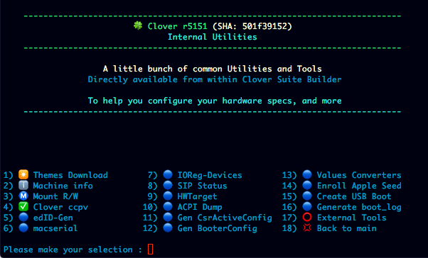
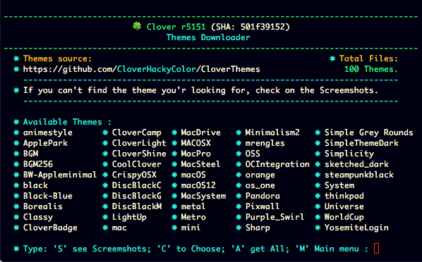
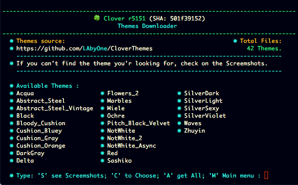

# Internal and external tools

    
## Internal Utilities
### Machine Info

### ConfigPlist Validator

### Mac Serials Generator

### CSRActive Config Generator

### Booter Config Generator

### Enroll Apple Seed

### OS Downloader and USB Boot Creator

### Values Converters

### SIP Status Verifier

### HWTarget

### Themes Downloader

 on some repos you got to get also screenshots of listed themes for download
 
so you will have the possibility to get an idea of what your going to get quickly,

there's also a feature consisting in downloading the entire repos once into that tab

just by pressing ENTER key. 

#
[Back](https://github.com/LAbyOne/Clover-Suite-Builder)
